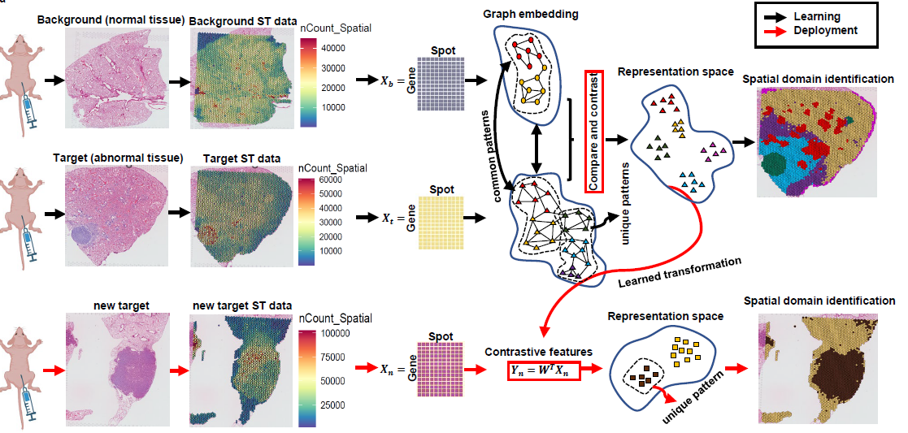

<div align="center">

# CoCoST: Compare and Contrast Spatial Transcriptomics

**A scalable contrastive learning framework for identifying spatial domains in spatial transcriptomics data**

[](https://github.com/WuLabMDA/CoCo-ST/stargazers)
[](https://github.com/WuLabMDA/CoCo-ST/issues)
[](https://github.com/WuLabMDA/CoCo-ST/blob/master/LICENSE)

</div>

---

## Overview

**CoCoST (Compare and Contrast Spatial Transcriptomics)** is a computational algorithm that leverages **contrastive learning** to identify both **high-variance** and **low-variance** spatial structures across spatial transcriptomics datasets.  
Unlike conventional methods that primarily detect dominant spatial domains, CoCoST uncovers subtle yet biologically meaningful spatial niches that are critical for understanding **early tumor evolution**, **precancerous changes**, and **cell–cell interactions**.

---

<p align="center">
  
</p>

## Key Features

-  **Contrastive spatial learning** – disentangles unique and shared structures across datasets (e.g., tumor vs. normal).  
-  **Multi-scale domain detection** – supports analysis at subcellular (2 µm), cellular (8 µm), and tissue (16 µm) scales.  
-  **Cross-sample integration** – harmonizes data from multiple samples and platforms (Visium, Visium HD, Xenium).  
-  **Scalable** – efficiently handles tens of millions of spatial spots.  
-  **Biologically interpretable** – links spatial domains to immune–stromal interactions and cancer evolution trajectories.  

---

## Installation

You can install the latest development version of **CoCoST** directly from GitHub:

```r
# Option 1: using devtools
# install.packages("devtools")
devtools::install_github("WuLabMDA/CoCo-ST")

# Option 2: using remotes
# install.packages("remotes")
remotes::install_github("WuLabMDA/CoCo-ST")


---

## Tutorials

We provide detailed tutorials demonstrating how to run **CoCoST** on various spatial transcriptomics datasets and integrate it with downstream spatial analysis frameworks.

| Tutorial | Description | Link |
|-----------|--------------|------|
| **Basic Tutorial** | Run CoCoST on toy datasets to extract contrastive spatial domains | [View →](https://github.com/WuLabMDA/CoCo-ST/tree/main/tutorials/basic_tutorial.Rmd) |
| **Visium HD Analysis** | Apply CoCoST on high-resolution (2 µm–16 µm) Visium HD data for multi-scale domain detection | [View →](https://github.com/WuLabMDA/CoCo-ST/tree/main/tutorials/visium_hd_tutorial.Rmd) |
| **Cross-Sample Integration** | Integrate multiple spatial samples and visualize contrastive domains | [View →](https://github.com/WuLabMDA/CoCo-ST/tree/main/tutorials/multi_sample_integration.Rmd) |
| **Cell–Cell Interaction Tutorial** | Combine CoCoST spatial domains with cell–cell interaction analysis (e.g., CellChat, NicheNet) | [View →](https://github.com/WuLabMDA/CoCo-ST/tree/main/tutorials/cell_interaction_tutorial.Rmd) |

---


